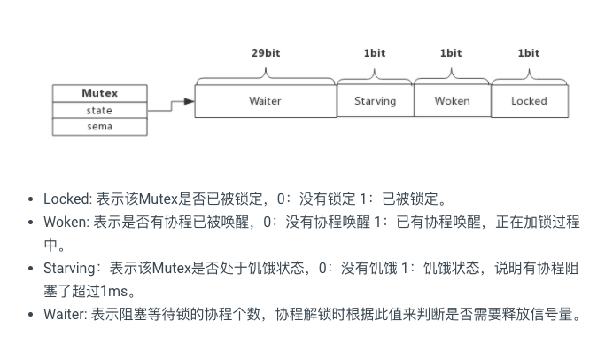

# 常见控制结构实现原理分析
- defer
- select
- mutex
- rwmutex
- range
### defer
```go
type _defer struct {
    sp      uintptr   //函数栈指针
    pc      uintptr   //程序计数器
    fn      *funcval  //函数地址
    link    *_defer   //指向自身结构的指针，用于链接多个defer
}
```
所以它其实是有一个栈的空间的，这样的话就是先入后出了。

### select

```go
type scase struct {
    c           *hchan         // chan
    kind        uint16
    elem        unsafe.Pointer // data element
}
```
这是case的底层。c是当前操作的channel，它直接是指向了一个指针。所以一个case只能处理一个goroutine
kind意思是 读channe或者是写channel 或者是default

elem是缓存，读的时候是要即将要读的地址，写的时候是即将要写的地址。

select的读取过程
```go
func selectgo(cas0 *scase, order0 *uint16, ncases int) (int, bool) {
    //1. 锁定scase语句中所有的channel
    //2. 按照随机顺序检测scase中的channel是否ready
    //   2.1 如果case可读，则读取channel中数据，解锁所有的channel，然后返回(case index, true)
    //   2.2 如果case可写，则将数据写入channel，解锁所有的channel，然后返回(case index, false)
    //   2.3 所有case都未ready，则解锁所有的channel，然后返回（default index, false）
    //3. 所有case都未ready，且没有default语句
    //   3.1 将当前协程加入到所有channel的等待队列
    //   3.2 当将协程转入阻塞，等待被唤醒
    //4. 唤醒后返回channel对应的case index
    //   4.1 如果是读操作，解锁所有的channel，然后返回(case index, true)
    //   4.2 如果是写操作，解锁所有的channel，然后返回(case index, false)
}
```
注意哦 case中可读可写。 只要读了或者写了，那么就会返回不再执行了。如果有default
就会去执行default，如果没有，那么就会阻塞了。

**哦对了，被关闭的chan虽然不能写入，但是可读** 这一条已经要牢牢的记住

- select语句中除default外，每个case操作一个channel，要么读要么写
- select语句中除default外，各case执行顺序是随机的
- select语句中如果没有default语句，则会阻塞等待任一case
- select语句中读操作要判断是否成功读取，关闭的channel也可以读取

### range
- 遍历过程中可以视情况放弃接收index或value，可以一定程度上提升性能
- 遍历channel时，如果channel中没有数据，可能会阻塞
- 尽量避免遍历过程中修改原数据

- for-range的实现实际上是C风格的for循环
- 使用index,value接收range返回值会发生一次数据拷贝

### mutex
```go
type Mutex struct {
    state int32
    sema  uint32
}
```
加锁后立即使用defer对其解锁，可以有效的避免死锁。
加锁和解锁最好出现在同一个层次的代码块中，比如同一个函数。
重复解锁会引起panic，应避免这种操作的可能性

### rwmutex
比如数据库的读写的时候，读要比写多得多，那么我们就可以使用这么个读写锁，只在读的时候加锁即可。
